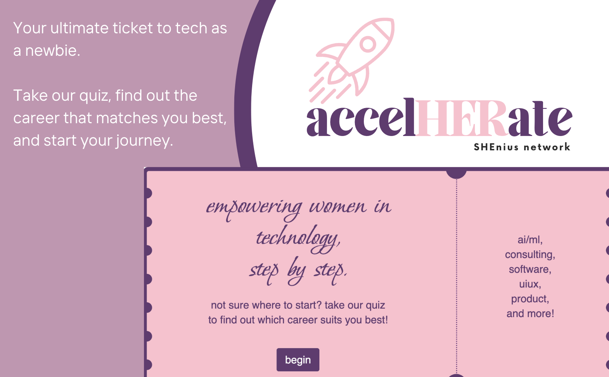

# Welcome to My GitHub Profile!

## Hi there! I'm Bratee 👋

I am a Computer Science student pursuing a Bachelors in Science at Georgia Institute of Technology. Currently, I am specializing in Intelligence and Information Infonetworks within my degree.

I also love building projects and attending hackathons in general!

## About Me

I have experience in:
- **Programming Languages:** Java, Python, JavaScript, C, C++, HTML, CSS
- **Frameworks:** SpringBoot, Node.js, Express.js, NextJS, REACT
- **Tools:** Git, Docker, MATLAB, Asana, Jira
- **Databases:** MySQL, CockroachDB

Feel free to connect with me on [LinkedIn](https://www.linkedin.com/in/bratee-podder/) or check out my [Portfolio](https://your-portfolio.com).

## Projects
  
 

<!--
**brateepodder/brateepodder** is a ✨ _special_ ✨ repository because its `README.md` (this file) appears on your GitHub profile.

Here are some ideas to get you started:

- 🔭 I’m currently working on ...
- 🌱 I’m currently learning ...
- 👯 I’m looking to collaborate on ...
- 🤔 I’m looking for help with ...
- 💬 Ask me about ...
- 📫 How to reach me: ...
- 😄 Pronouns: ...
- ⚡ Fun fact: ...
-->
